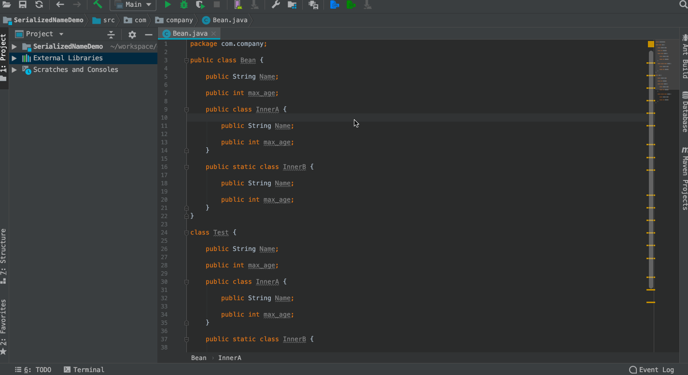

# Gson SerializedName Gen

---

GsonSerializedNameGen 是一个自动生成Gson SerializedName注解的插件。

[下载地址](./jars)

[插件地址](https://plugins.jetbrains.com/plugin/11225-gsonserializednamegen)

# 介绍

有时候经常会维护一些老的项目，可能由于历史或开发人员能力问题，代码会稍微不规范。

比如在请求网络数据时会需要把json反序列化成实体，然后下面是常见的一种方式。

```java
public class Bean {

    public String Name;

    public int max_age;
    
    public class InnerA {

        @SerializedName("Name")
        public String Name;

        @SerializedName("max_age")
        public int max_age;
    }

    public static class InnerB {

        public String Name;

        public int max_age;
    }
}
```
上面的代码是很规范的，首先代码中字段名字命名规则是不满足驼峰规则的，其次需要添加json别名注解，比如常见的`Gson`，需要添加`@SerializedName`注解，否则不能进行代码混淆。

一些有强迫症的程序员就会手动修改这些代码，但是是历史代码，可能一不小心就改坏了，修改需要一定的工作量，并且是重复劳动的工作，那么此工具就是干这样的事情的，使用工具优化后，就变成了下面样子。

```java
public class Bean {

    @SerializedName("Name")
    public String Name;

    @SerializedName("max_age")
    public int max_age;
    
    public class InnerA {

        @SerializedName("Name")
        public String Name;

        @SerializedName("max_age")
        public int max_age;
    }

    public static class InnerB {

        @SerializedName("Name")
        public String Name;

        @SerializedName("max_age")
        public int max_age;
    }
}
```

# 使用姿势

## 支持特性

当前版本为基本版本，仅仅支持Java语言生成`SerializedName`注解。

## 示例演示



# 其他

第一个版本，实现有点仓促，如果有问题，欢迎交流，xiaqiulei@126.com。

## 后续规划

* 支持Kotlin语言

* 支持其他方式json序列化工具

* 支持删除某一种json序列化工具别名

# 日志

* v0.1

第一个版本，实现基本功能